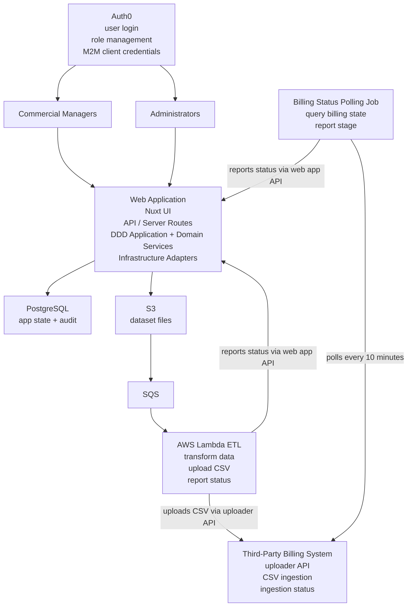

# High Level Architecture

## Purpose

- Describe the overall system landscape around the web application
- Show how external ingestion and billing components interact with the application
- Clarify which parts belong to this repository and which parts are external systems

## System Scope

- The web application provides operational visibility, manual upload capability, partner channel configuration, and controlled actions around ingestion tracking
- The web application owns its own API, domain logic, database, and UI
- External ingestion components and the third-party billing system remain outside the application's implementation scope, but they integrate with the application through APIs and status reporting
- `Ingestion` refers to the application-owned lifecycle record, while `mediation` refers specifically to the Lambda processing step performed after file arrival

## Main Components

- Commercial manager users interact with the web UI for manual uploads and partner channel configuration
- Administrator users interact with the web UI for monitoring, investigation, and operational actions
- The web application consists of a Nuxt UI, server-side API endpoints, domain/application services, and infrastructure adapters
- Auth0 provides user authentication, role management, and machine-to-machine credentials
- PostgreSQL stores application state, audit metadata, ingestion tracking, and billing transfer monitoring data
- S3 stores uploaded dataset files
- SQS receives S3 object creation events
- AWS Lambda performs ETL and reports processing state back to the web application API
- A scheduled billing-status polling job queries the billing system every 10 minutes and reports billing ingestion stage back to the web application API
- The third-party billing system uploader API receives CSV uploads from the ETL flow
- The third-party billing system later ingests CSV files and exposes ingestion progress to the polling job

## High Level Flow

- A dataset ingestion starts from manual upload, API collector start, or SFTP file arrival
- Uploaded or detected files are stored in S3
- S3 emits events to SQS
- Lambda consumes the relevant queue messages, performs ETL, uploads CSV output to the third-party billing system, and reports progress to the web application's API using Auth0 client credentials
- A separate scheduled job polls the third-party billing system every 10 minutes for downstream ingestion state and reports billing-system stage updates to the web application's API using machine-to-machine authentication
- The web application stores both internal ingestion state and external billing-system state for operational visibility

## Mermaid Diagram

## Repository Coverage

- This repository currently covers the specification and design documents for the web application architecture
- At the moment, the repository does not contain the actual application source code, infrastructure code, Lambda implementation, polling job implementation, or deployment configuration
- The current repository scope is the web application and its supporting design decisions, not the external SFTP process, API collector, billing system internals, or partner-owned systems
- The files currently present in `specs/` define the high-level features, tech stack, database design rules, and this architecture overview

## Boundary Summary

- In scope for this repository's intended future implementation: web UI, web API, domain/application layers, PostgreSQL schema, manual upload flow, partner channel configuration, status tracking, and auditability
- Out of scope for this repository's intended future implementation: external SFTP implementation, partner API collector implementation, billing system internals, and partner-owned upstream systems
- Integrated but externally owned: Auth0, S3, SQS, AWS Lambda ETL flow, the third-party billing system uploader API, and the third-party billing ingestion engine